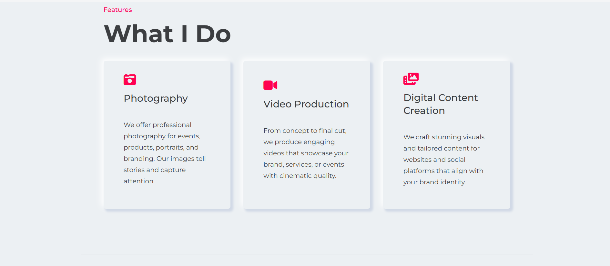
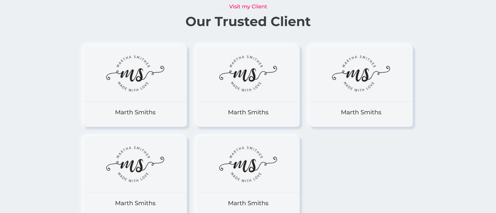
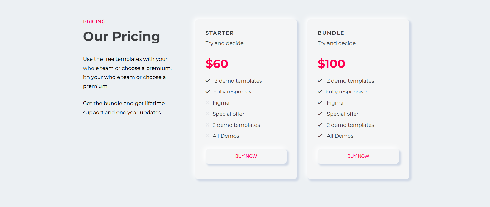
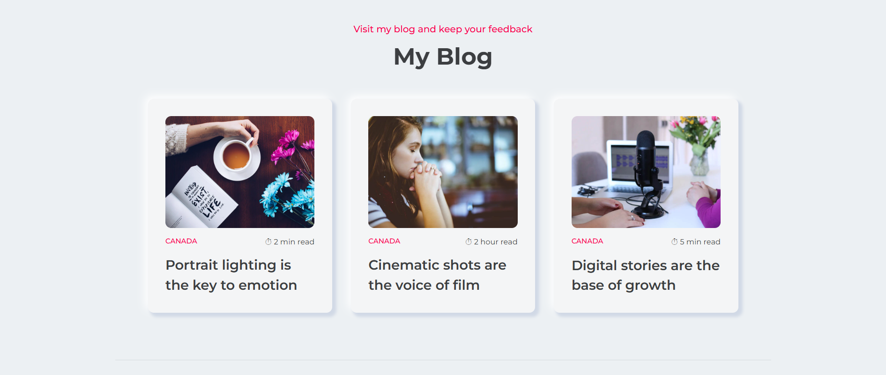
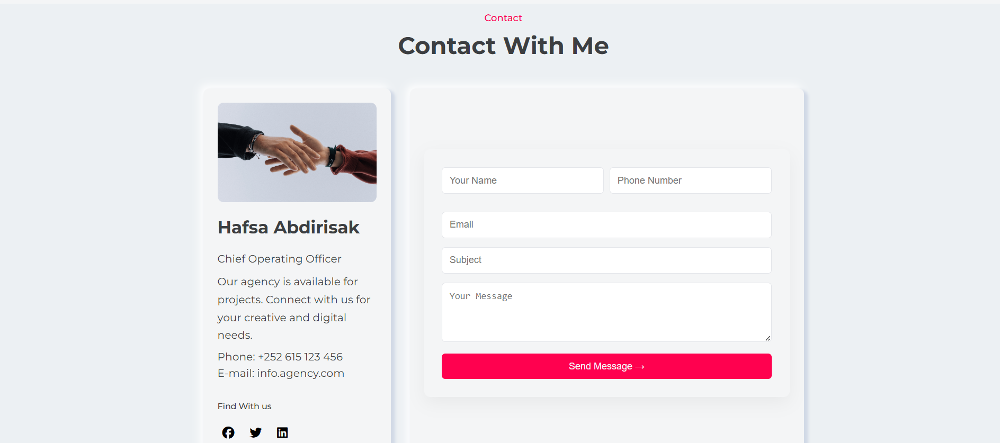
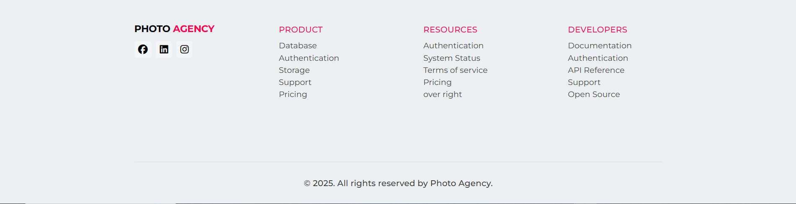

# 📸 Photo Agency Website

A professional and modern **agency website** designed to showcase photography, video production, and digital content creation services. Built with clean code, elegant design, and a strong focus on collaboration and user experience.

---

## 🚀 Live Demo

🌐 [Visit the Live Site](https://photo-agency-site.vercel.app/)

---

## 🏗️ Project Overview

The **Photo Agency Website** serves as a digital presence for a creative agency, highlighting its core services, satisfied clients, and insightful blog content. Developed with HTML, CSS, and JavaScript, the site is fully responsive and optimized for performance and usability.

---

## 📁 Website Structure

### 🧩 Main Sections:

1. **Header** – Logo and site-wide navigation
2. **Hero Section** – Engaging headline and tagline
3. **About Section** – Agency introduction and story
4. **Services Section** – Core services (Photography, Video Production, Digital Content)
5. **Clients Section** – Partner logos and client list
6. **Testimonials Section** – Quotes from happy clients
7. **Pricing Section** – Service packages and rates
8. **Blog Section** – Industry tips and agency updates
9. **Contact Section** – Form and contact information

---

## 🛠️ Technologies Used

- HTML5
- CSS3
- JavaScript (Vanilla)
- FontAwesome (Icons)

---

## 📸 Screenshots

### 🏠 Homepage  


### 🙋‍♂️ About Section  


### 💼 Services Section  


### 🤝 Clients Section  


### 🗣️ Testimonials Section  


### 💰 Pricing Section  


### 📰 Blog Section  


### 📞 Contact Section  


### 🔻 Footer Section  


---

## 🤝 Contributors

- **[@engisak](https://github.com/engisak)** – Developer  
- **[@Hafsa Abdirisak Ismail](https://github.com/HafsaAbdirisak7979)** – Developer   

We used GitHub for collaboration, branch management, and pull requests.

---

## 🔧 Getting Started

```bash
git clone https://github.com/dugsiiyeinc/photo-agency-site.git
cd photo-agency-site
